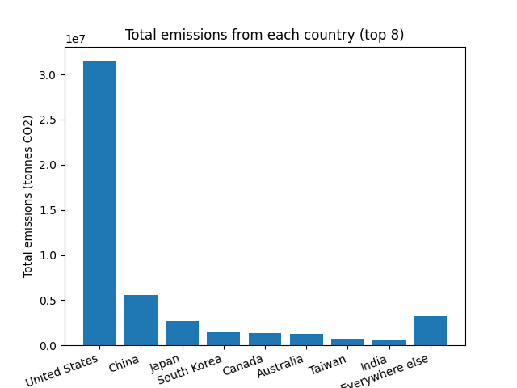

# Conference travel emissions

This is an archive of the completed individual projects from the 2022-2023 "Research Software Engineering with Python" module which was taught by xxx.

`This assignment asks you to create some classes and functions to load and process a CSV dataset. You will also need to create some tests and commit your work as you progress in a git repository`

----

# Usage
1. **Install Dependencies:**
   - Make sure you have Python installed on your system.
   - Install required dependencies by running:
     ```bash
     pip install cities matplotlib
     ```

2. **Prepare Data:**
   - Ensure your attendee data is stored in a CSV file with the following columns:
     - Number of attendees
     - Country
     - City
     - Latitude
     - Longitude
     - Distance

3. **Run the Script:**
   - Run the script `main.py` with Python:
     ```bash
     python main.py
     ```

4. **Output:**
   - The script will read the attendee data, perform analysis, and display summaries and visualizations, including top emitters from a specified city.

## Example
```python
from cities import City
from utils import read_attendees_file

if __name__ == "__main__":
    # File path
    filepath = 'attendee_locations.csv'

    # Read city collection
    col = read_attendees_file(filepath)

    # Example usage (choose Zurich as a travel destination)
    zurich = City('Zurich', 'Switzerland', 52, 47.22, 8.33)
    col.summary(zurich)
    col.plot_top_emitters(city=zurich, n=8, save=True)
```
## Output
### 1. Summary
```bash
Host city: Zurich (Switzerland)
Total CO2: 48488190 tonnes
Total attendees travelling to Zurich from 1766 different cities: 24008
```
### 2. Top emitters from Zurich
